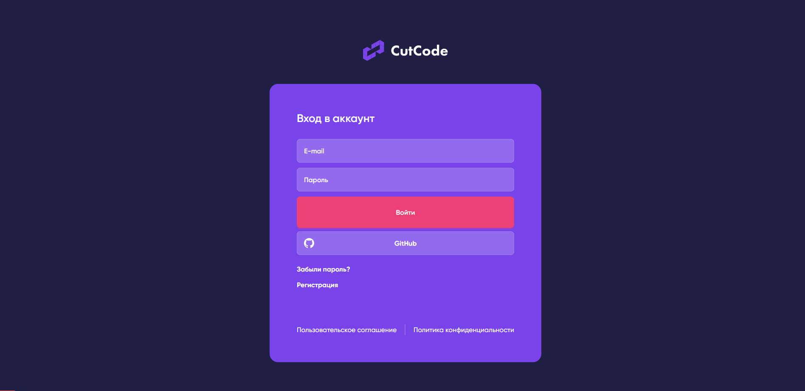
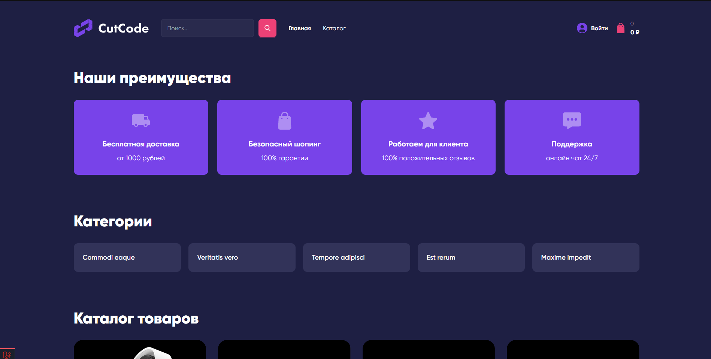
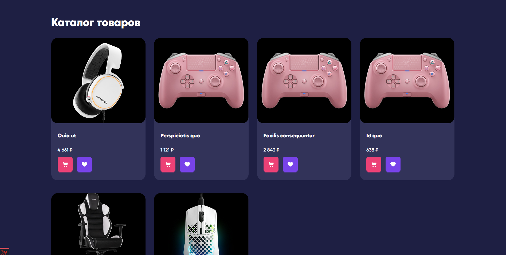
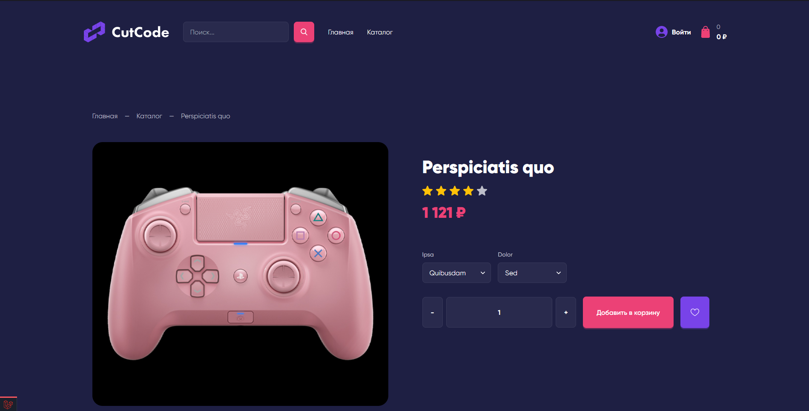
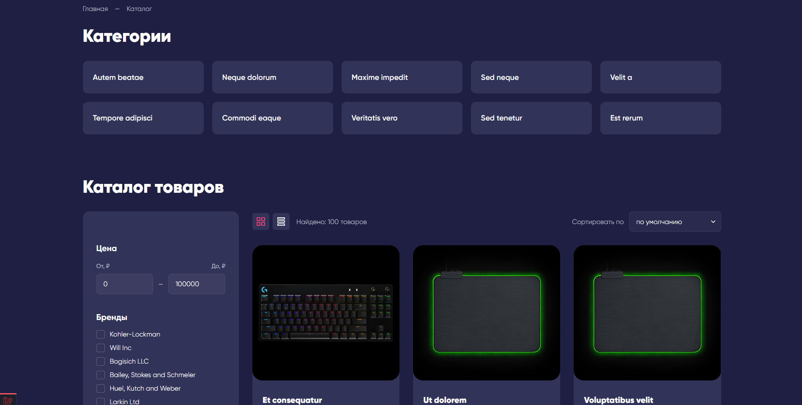
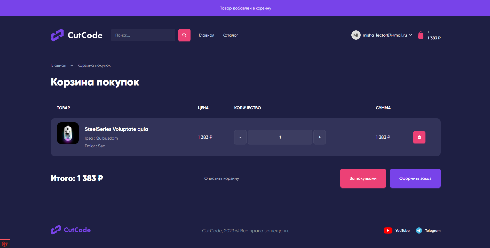
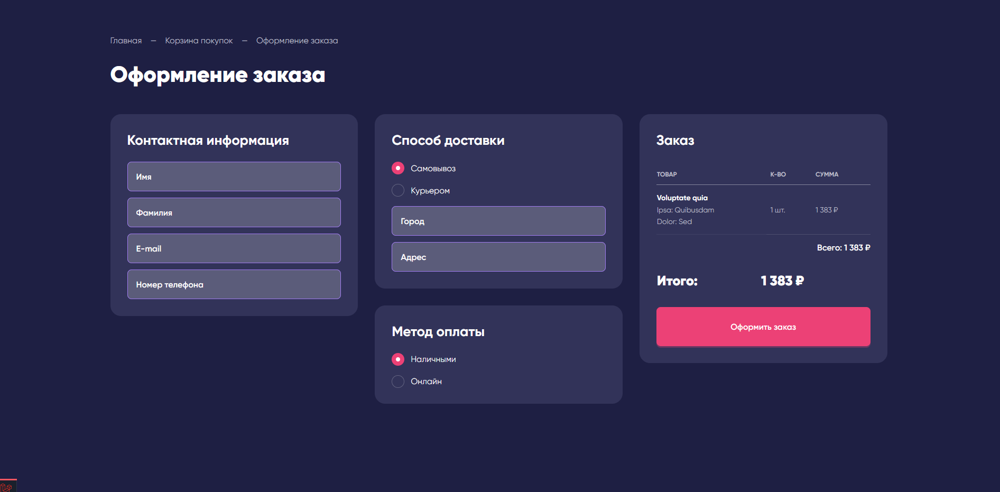

# Laravel PC Shop

## Installation

- git clone https://github.com/sodaler/laravel_pc_shop.git
- cd laravel_pc_shop
- cp .env.example .env
- composer install
- npm install
- shop:install
- shop:refresh

## Some Screenshots

### Login

### Main

### Product

### Catalog

### Cart

### Order

